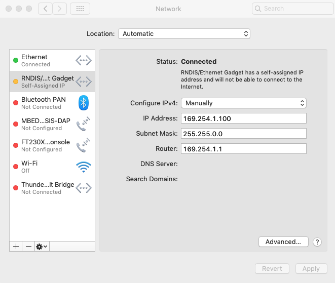
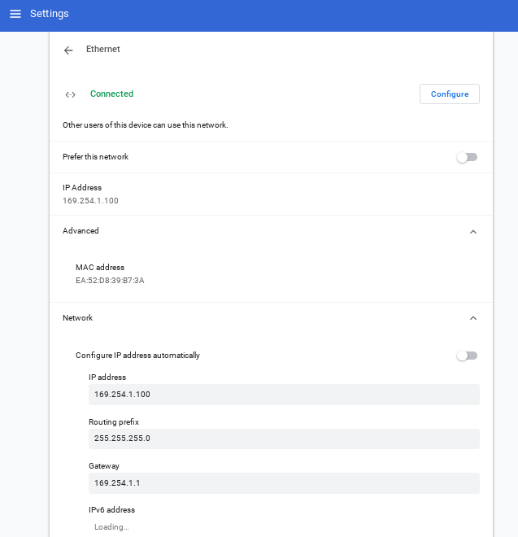
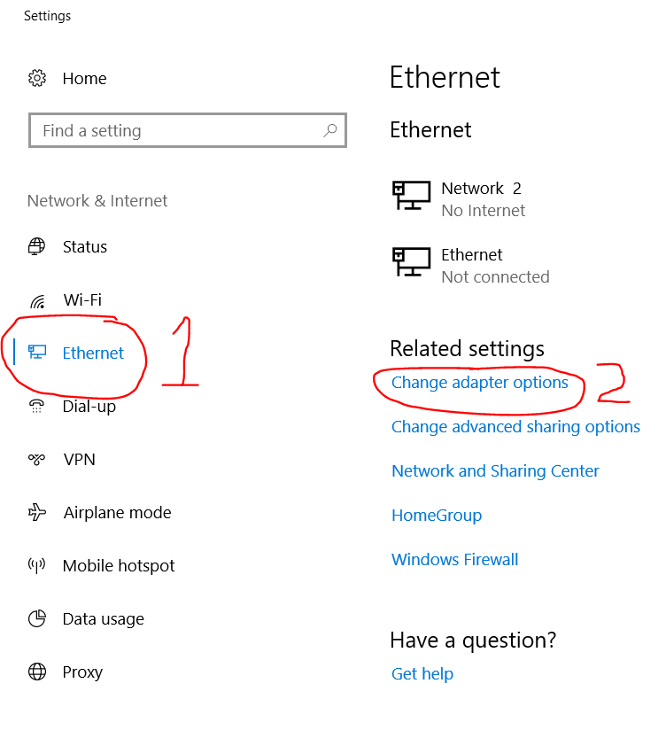
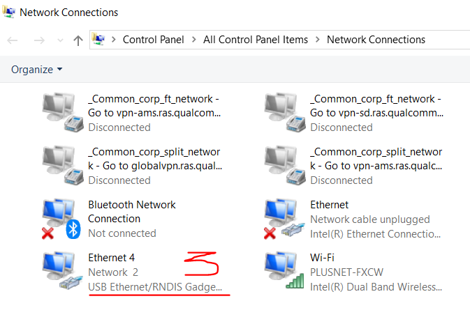
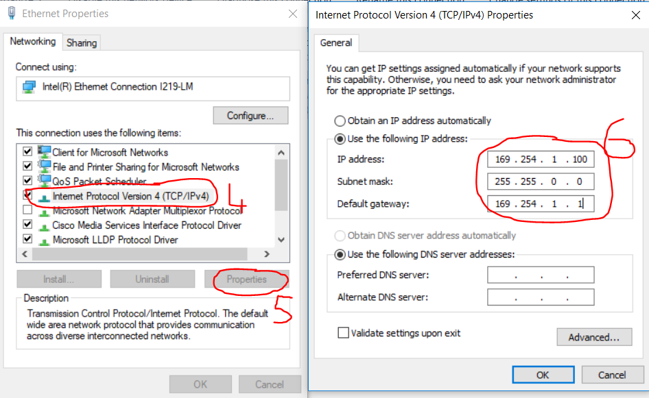
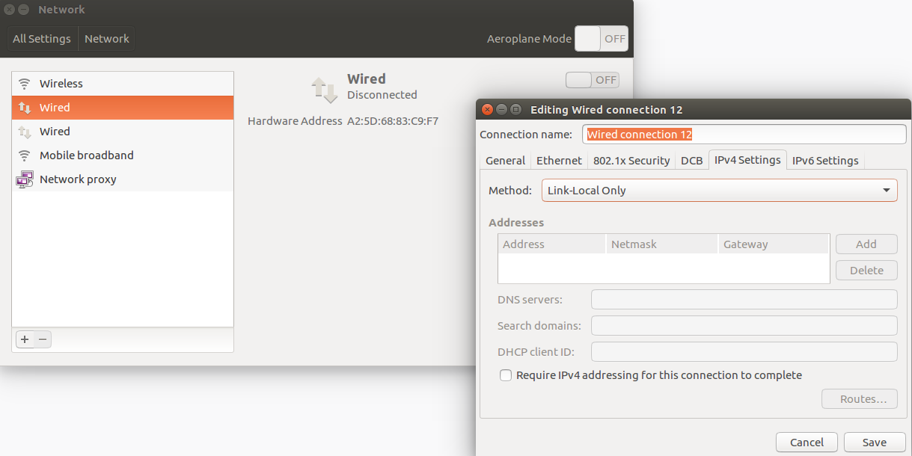
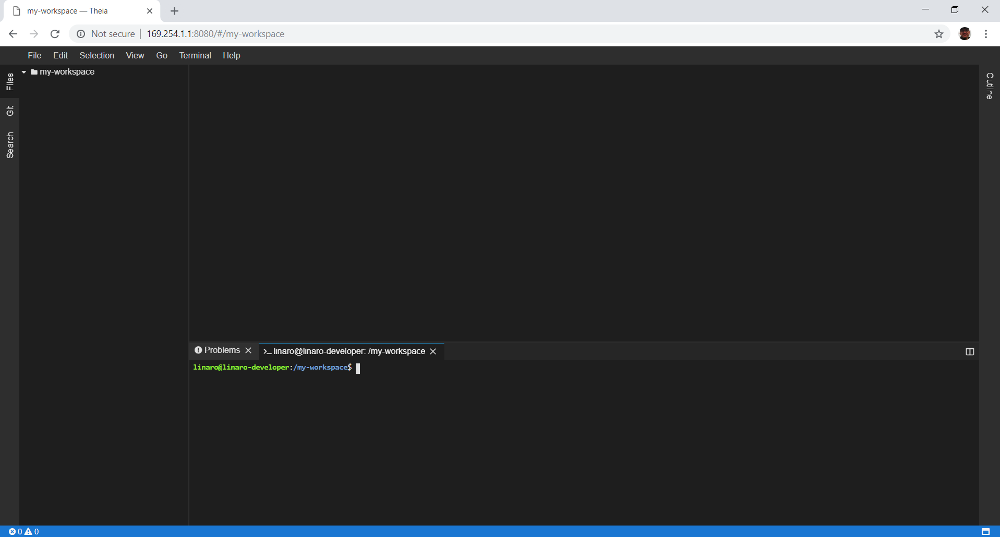
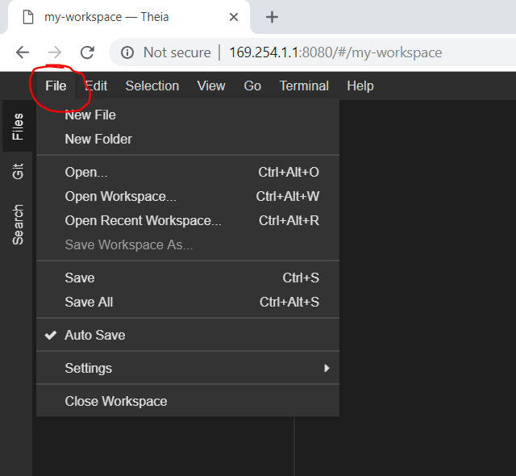
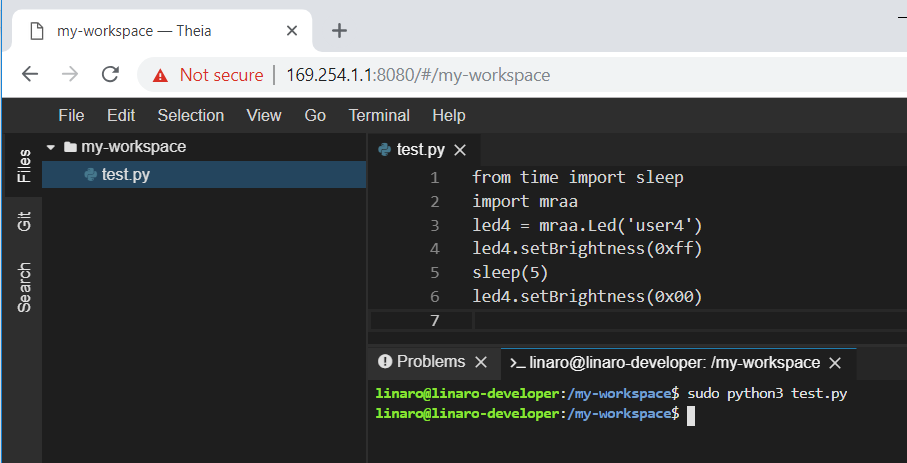

==================
User Documentation
==================

Project Martha
==============

This project is about using a Dragonboard configured with a Web IDE allowing it to be accessed over
USB from a laptop or host computer.
This is to enable  people to create Python code quickly on the Dragonboard without the need
for additional peripherals such as keyboards and monitors. This is useful in situations where you
want to get set-up quickly and do some experimentation such as at workshops or hackathons.

If you have a Dragonboard that is already configured with the Web IDE then plug in the USB cable to
your laptop and other end into the micro-USB connector on the Dragonboard. Plugin the power cable
for the Dragonboard.

.. image:: ../assets/image2.png
    :width: 50%
    :align: center

You will now configure the network connection on your laptop.
Choose the instruction for the operating system on your laptop

Setting up laptop
=================

On a mac
--------
In `System Preferences > Network`, configure the RNDIS/Ethernet Gadget to have a
static IP Address of :code:`169.254.1.100` and the router value of :code:`169.254.1.1`

Open a browser on your mac and type in the URL http://169.254.1.1:8080

On a Chromebook
---------------
In Settings configure the Ethernet connection to have an IP Address of :code:`169.254.1.100`
and Gateway to :code:`169.254.1.1`

Open a browser on your Chromebook and type in the URL http://169.254.1.1:8080


On Windows 10
--------------
Windows 10 should automatically detect that you have a Link-Local connection and setup automatically. It can take
a minute or so to happen. If it does not do it automatically, it can be done manually with:

In Control Panel > All Control Panel Items > Network Connections, set the IPv4 IP address for the
USB Ethernet/RNDIS Gadget to :code:`169.254.1.100` and the Gateway to :code:`169.254.1.1`

Open a browser on your PC and type in the URL http://169.254.1.1:8080

On Linux
--------
Set the “Wired” connections IPv4 Settings to “Link-Local Only”

Open a browser on your PC and type in the URL http://169.254.1.1:8080


Using the IDE
=============
The first time the Web IDE is opened it will start with a blank “my-workspace”

To get started creating code, select “New File” from the file pulldown menu “File” menu.

To run your new program make sure there is a terminal window open to type the command.
If there is no terminal it can be opened from the “Terminal” pulldown menu

When interacting with the hardware on the Dragonboard Python must be run with ‘sudo’ e.g:
:code:`sudo python3 <filename>`

Try this piece of code to flash one of the Dragonboard LEDs

.. code:: python

    from time import sleep
    import mraa
    led4 = mraa.Led('user4')
    led4.setBrightness(0xff)
    sleep(5)
    led4.setBrightness(0x00)

Internet Access
===============

:code:`sudo nmtui`

Downloads
=========

Windows 10
----------

https://drive.google.com/uc?export=download&id=1cvi9Lnc0ciS4LlwA0AVm6QX0eIdlnx9A

Linux
-----

https://drive.google.com/uc?export=download&id=1S_brfMUM4jLUY_OLwr3S5ubeirJQblKy

Mac OS
------

https://drive.google.com/uc?export=download&id=12rqljOy7uLq329vy_AtDHpa0mEFY2zbS